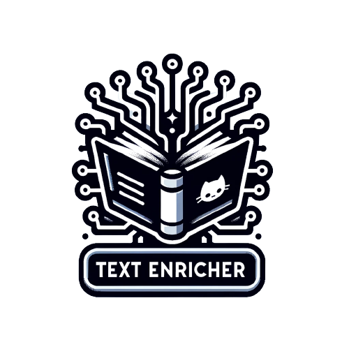

# 📚 Text Enrichment Library (WIP)


Unlock deeper insights from your text data. The Text Enrichment Library provides a simple interface to extract valuable metadata from chunks of text using state-of-the-art models.

<p align="center">
  
</p>

## 🚀 Features

- **Named Entity Recognition (NER)**: Extract names of entities from your text.
- **Entity Linking**: Link identified entities to a knowledge base.
- **Batch/Splitting Handling**: Efficiently process large volumes of text with multiple batching strategies.
  
## 🛠 Installation

```bash
pip install text_enrichment
```

## 🧰 Usage

```python
from text_enrichment import Enricher

# Initialize the enricher with desired models
enricher = Enricher(models=["ner", "entity_linking"])

# Process your text
text_input = "OpenAI is revolutionizing artificial intelligence."
enriched_data = enricher.process(text_input)

print(enriched_data)
```

## 🔄 Batching Strategies

Our library offers multiple batching strategies to cater to different text processing needs:

- **Characters**: Split by character count.
- **Sentences**: Split by sentences.
- **Paragraphs**: Split by paragraphs.

## 📈 Roadmap

- Integrate more models for text analysis.
- Add multilingual support.
- Optimize for real-time processing.

## 🙏 Contributing

We love contributions! Please see our `CONTRIBUTING.md` for details on how to pitch in.

## 📄 License

This project is licensed under the MIT License. See the `LICENSE.md` file for details.
